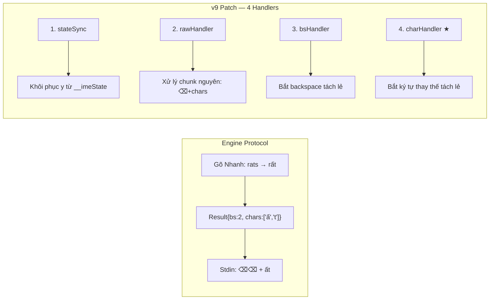
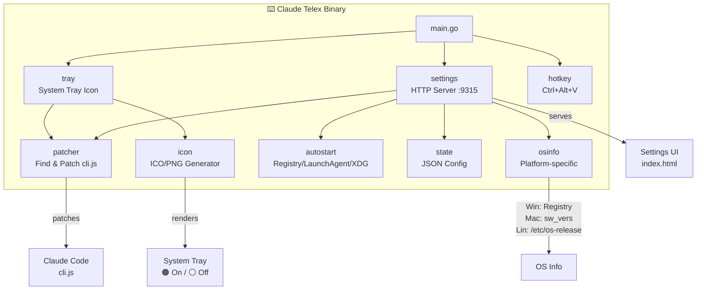
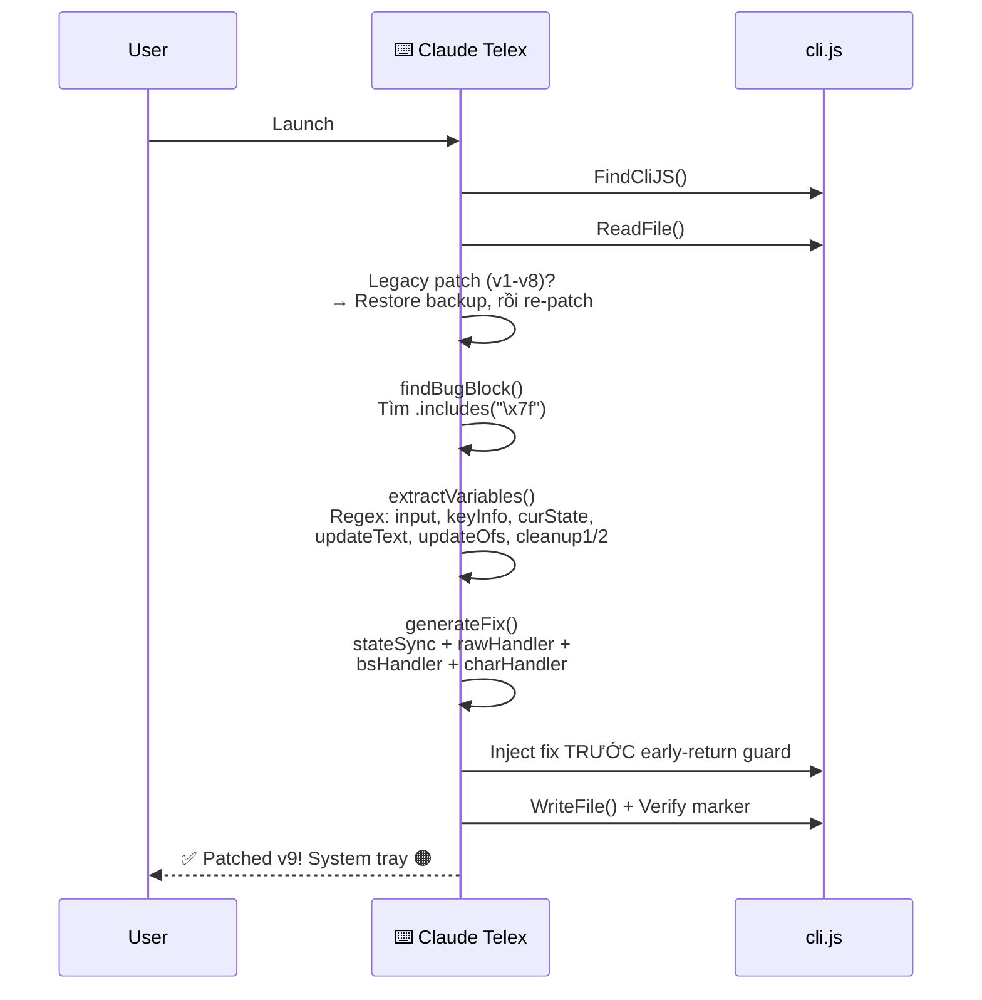
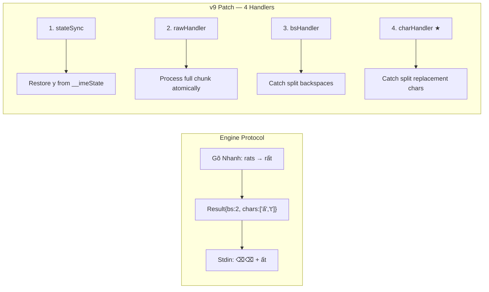
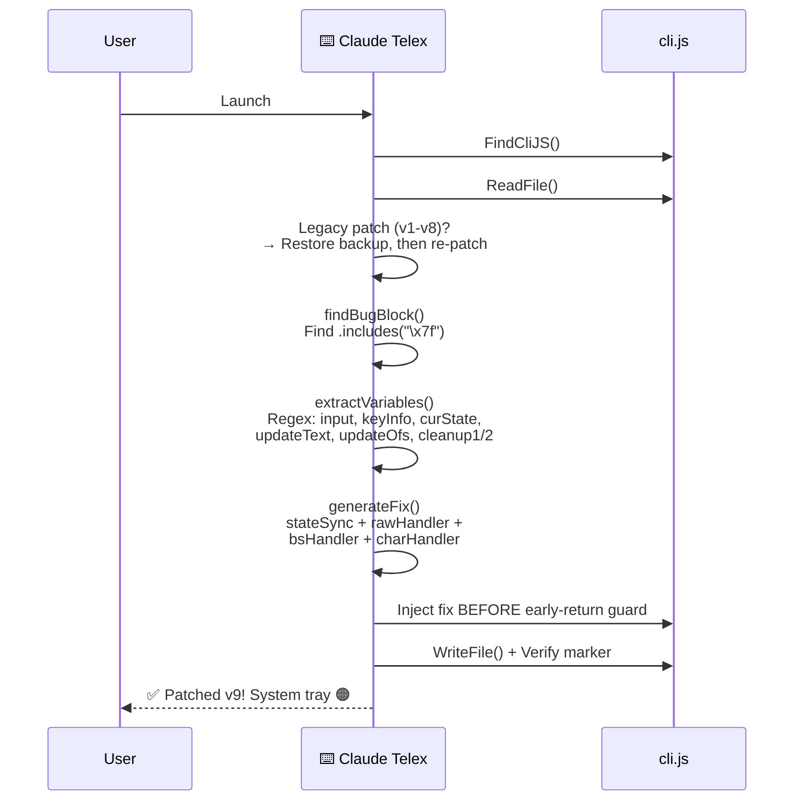

<p align="center">
  <a href="https://github.com/nguyenhx2/Claude-Telex"></a>
  
  
  
</p>

<h1 align="center">⌨️ Claude Telex</h1>

<p align="center">
  <a href="#vietnamese">🇻🇳 Tiếng Việt</a> ·
  <a href="#english">🇬🇧 English</a>
</p>

---

<a id="vietnamese"></a>

## 🇻🇳 Tiếng Việt

### Vấn đề

Khi gõ tiếng Việt bằng bộ gõ TELEX (EVKey, UniKey, GoTiengViet, [Gõ Nhanh](https://github.com/phucanh08/gonhanh)...) trong Claude Code CLI, ký tự bị **mất** hoặc **hiển thị sai**.

> **Ví dụ:** Gõ `banj` mong đợi `bạn`, nhưng nhận được `bn` hoặc text bị lỗi.

### Nguyên nhân gốc

Bộ gõ tiếng Việt hoạt động theo giao thức **backspace + thay thế**: gửi N × `\x7F` (xóa) rồi gửi ký tự thay thế. Hai vấn đề trong Claude Code:

1. **Stale closure**: Hàm `G6` (onInput) đọc state `y` từ React closure — state này **không cập nhật** giữa các event trong một burst IME
2. **Split events**: Ink tách burst thành nhiều G6 call riêng biệt — backspace và ký tự thay thế đến ở các call khác nhau
3. **P6 dùng state cũ**: Hàm xử lý ký tự `P6(J6)(t)` capture state từ React render, không từ `__imeState` bridge

### Giải pháp — Engine-Aware Patch v9

Dựa trên phân tích kĩ [tài liệu kiến trúc của Gõ Nhanh](docs/core-engine-algorithm.md), Claude Telex **patch trực tiếp** vào `cli.js` với 4 thành phần:



**Các chi tiết quan trọng:**

| Thành phần | Mô tả |
|---|---|
| `stateSync` | Khôi phục `y` từ `globalThis.__imeState`, clear khi React catch up hoặc control key |
| `rawHandler` | Khi `\x7f` trong input → xử lý toàn bộ chunk atomically |
| `bsHandler` | Khi Ink tách `\x7f` thành `backspace=true` → bridge state |
| `charHandler` ★ | Khi `__imeState` active + ký tự bình thường → `y.insert()` trực tiếp, bypass `P6` (stale closure) |
| Auto-upgrade | Tự phát hiện patch v1–v8 và nâng cấp |

### Cài đặt

#### Windows (PowerShell)

```powershell
irm https://raw.githubusercontent.com/nguyenhx2/Claude-Telex/main/install.ps1 | iex
```

#### macOS / Linux

```bash
curl -fsSL https://raw.githubusercontent.com/nguyenhx2/Claude-Telex/main/install.sh | bash
```

#### Từ Source

```bash
go install github.com/nguyenhx2/claude-telex/cmd/claude-telex@latest
```

### Sử dụng

Chạy `claude-telex` - app sẽ:

1. 🔍 Tự động tìm `cli.js` của Claude Code
2. 🩹 Patch logic xử lý IME (v9 engine-aware)
3. 🖥️ Hiển thị icon ở system tray (cam = bật, xám = tắt)
4. ⚙️ Mở Settings UI tại `http://127.0.0.1:9315`

| Thao tác | Cách thực hiện |
|---|---|
| **Bật/Tắt fix** | Click tray icon → Settings, hoặc `Ctrl+Alt+V` |
| **Re-patch** | Settings UI → "Re-patch ngay" |
| **Khởi động cùng máy** | Settings UI → toggle "Khởi động cùng hệ thống" |
| **Thoát** | Right-click tray icon → Thoát |

### ⌨️ Bộ gõ được hỗ trợ

| Bộ gõ | Hệ điều hành | Trạng thái |
|---|---|---|
| **EVKey** | Windows | ✅ Hỗ trợ đầy đủ |
| **UniKey** | Windows | ✅ Hỗ trợ đầy đủ |
| **GoTiengViet** | Windows / macOS | ✅ Hỗ trợ đầy đủ |
| **ibus-bamboo** | Linux | ✅ Hỗ trợ đầy đủ |
| Bộ gõ khác (gửi `\x7F`) | Tất cả | ✅ Hoạt động |

### 🖥️ Tương thích

| Thành phần | Phiên bản | Trạng thái |
|---|---|---|
| 🤖 **Claude Code** | Mọi phiên bản (npm `@anthropic-ai/claude-code`) | ✅ Hỗ trợ |
| 🪟 **Windows** | 10 / 11 (amd64, arm64) | ✅ Hỗ trợ |
| 🍎 **macOS** | 12 Monterey+ (Intel & Apple Silicon) | ✅ Hỗ trợ |
| 🐧 **Linux** | Ubuntu 20.04+, Fedora 36+, Arch (amd64, arm64) | ✅ Hỗ trợ |

### Kiến trúc



#### Tổng quan Package

| Package | Chức năng |
|---|---|
| `cmd/claude-telex` | Entry point, single-instance lock, orchestration |
| `internal/patcher` | Tìm `cli.js`, trích xuất biến động bằng regex, inject fix v9 (engine-aware) |
| `internal/tray` | System tray (ICO trên Windows, PNG trên macOS/Linux) |
| `internal/settings` | HTTP server tại port 9315, JSON API |
| `internal/icon` | Vẽ icon programmatically (vòng tròn + chữ "VN") |
| `internal/hotkey` | Global hotkey `Ctrl+Alt+V` |
| `internal/autostart` | Tự khởi động: Windows Registry / macOS LaunchAgent / Linux XDG |
| `internal/state` | Lưu config JSON tại `~/.claude-telex/config.json` |
| `assets/ui` | Embedded HTML Settings UI (dark theme, Inter font) |

### Luồng Patching (v9)



### Build & Chạy

#### Yêu cầu

- **Go** 1.22+ ([tải tại đây](https://go.dev/dl/))
- **Git** ([tải tại đây](https://git-scm.com/))
- **Linux**: cần thêm `gcc`, `libgtk-3-dev`, `libappindicator3-dev`

#### Build

```bash
# Clone repo
git clone https://github.com/nguyenhx2/Claude-Telex.git
cd Claude-Telex

# Build binary
go build -ldflags="-s -w -H windowsgui" -o claude-telex.exe ./cmd/claude-telex   # Windows
go build -ldflags="-s -w" -o claude-telex ./cmd/claude-telex                      # macOS / Linux

# Hoặc dùng Make
make build
```

#### Stop & Restart (Development — Windows)

```powershell
# Stop app đang chạy
Get-Process claude-telex -ErrorAction SilentlyContinue | Stop-Process -Force

# Build lại và chạy
go build -ldflags="-s -w -H windowsgui" -o claude-telex.exe ./cmd/claude-telex && `
  Start-Process -FilePath ".\claude-telex.exe" -WindowStyle Hidden

# Stop + Build + Restart trong một lệnh
Get-Process claude-telex -ErrorAction SilentlyContinue | Stop-Process -Force; `
  go build -ldflags="-s -w -H windowsgui" -o claude-telex.exe ./cmd/claude-telex && `
  Start-Process -FilePath ".\claude-telex.exe" -WindowStyle Hidden
```

#### Chạy (Development)

```bash
# Chạy trực tiếp (có console output)
go run ./cmd/claude-telex

# Chạy binary đã build
./claude-telex        # macOS / Linux
.\claude-telex.exe    # Windows
```

#### Release (snapshot)

```bash
goreleaser release --snapshot --clean
```

---

<a id="english"></a>

## 🇬🇧 English

### The Problem

When typing Vietnamese using TELEX IME (EVKey, UniKey, GoTiengViet, [Gõ Nhanh](https://github.com/phucanh08/gonhanh)...) in Claude Code CLI, characters are **lost** or **displayed incorrectly**.

> **Example:** Typing `banj` expecting `bạn`, but getting `bn` or garbled text.

### Root Cause

Vietnamese IMEs use a **backspace + replace** protocol: send N × `\x7F` (delete) then replacement chars. Two issues in Claude Code:

1. **Stale closure**: `G6` (onInput) reads `y` state from a React closure — this state **never updates** between events within an IME burst
2. **Split events**: Ink splits the burst into separate G6 calls — backspaces and replacement chars arrive in different calls
3. **P6 uses stale state**: The text processor `P6(J6)(t)` captures state from React render, not from the `__imeState` bridge

### The Solution — Engine-Aware Patch v9

Based on thorough analysis of the [Gõ Nhanh engine documentation](docs/core-engine-algorithm.md), Claude Telex **directly patches** `cli.js` with 4 components:



**Key v9 patch details:**

| Component | Description |
|---|---|
| `stateSync` | Restores `y` from `globalThis.__imeState`, clears when React catches up or on control keys |
| `rawHandler` | When `\x7f` in input → processes entire chunk atomically |
| `bsHandler` | When Ink splits `\x7f` into `backspace=true` → bridges state |
| `charHandler` ★ | When `__imeState` active + normal char → `y.insert()` directly, bypassing `P6` (stale closure) |
| Auto-upgrade | Auto-detects patches v1–v8 and upgrades |

### Installation

#### Windows (PowerShell)

```powershell
irm https://raw.githubusercontent.com/nguyenhx2/Claude-Telex/main/install.ps1 | iex
```

#### macOS / Linux

```bash
curl -fsSL https://raw.githubusercontent.com/nguyenhx2/Claude-Telex/main/install.sh | bash
```

#### From Source

```bash
go install github.com/nguyenhx2/claude-telex/cmd/claude-telex@latest
```

### Usage

Run `claude-telex` - the app will:

1. 🔍 Auto-detect Claude Code's `cli.js`
2. 🩹 Patch IME handling logic (v9 engine-aware)
3. 🖥️ Show a system tray icon (orange = on, grey = off)
4. ⚙️ Open Settings UI at `http://127.0.0.1:9315`

| Action | How |
|---|---|
| **Toggle fix** | Click tray icon → Settings, or `Ctrl+Alt+V` |
| **Re-patch** | Settings UI → "Re-patch now" |
| **Start with OS** | Settings UI → toggle "Start with system" |
| **Exit** | Right-click tray icon → Exit |

### ⌨️ Supported IME

| IME | OS | Status |
|---|---|---|
| **EVKey** | Windows | ✅ Fully supported |
| **UniKey** | Windows | ✅ Fully supported |
| **GoTiengViet** | Windows / macOS | ✅ Fully supported |
| **ibus-bamboo** | Linux | ✅ Fully supported |
| Other IMEs (sending `\x7F`) | All | ✅ Works |

### 🖥️ Compatibility

| Component | Version | Status |
|---|---|---|
| 🤖 **Claude Code** | All versions (npm `@anthropic-ai/claude-code`) | ✅ Supported |
| 🪟 **Windows** | 10 / 11 (amd64, arm64) | ✅ Supported |
| 🍎 **macOS** | 12 Monterey+ (Intel & Apple Silicon) | ✅ Supported |
| 🐧 **Linux** | Ubuntu 20.04+, Fedora 36+, Arch (amd64, arm64) | ✅ Supported |

### Architecture


#### Package Overview

| Package | Description |
|---|---|
| `cmd/claude-telex` | Entry point, single-instance lock, orchestration |
| `internal/patcher` | Find `cli.js`, extract dynamic vars via regex, inject fix v9 (engine-aware) |
| `internal/tray` | System tray (ICO on Windows, PNG on macOS/Linux) |
| `internal/settings` | HTTP server at port 9315, JSON API |
| `internal/icon` | Programmatic icon rendering (circle + "VN" text) |
| `internal/hotkey` | Global hotkey `Ctrl+Alt+V` |
| `internal/autostart` | Auto-start: Windows Registry / macOS LaunchAgent / Linux XDG |
| `internal/state` | JSON config at `~/.claude-telex/config.json` |
| `assets/ui` | Embedded HTML Settings UI (dark theme, Inter font, copy CLI path) |

### Patching Flow (v9)



### Build & Run

#### Prerequisites

- **Go** 1.22+ ([download](https://go.dev/dl/))
- **Git** ([download](https://git-scm.com/))
- **Linux**: also needs `gcc`, `libgtk-3-dev`, `libappindicator3-dev`

#### Build

```bash
# Clone the repo
git clone https://github.com/nguyenhx2/Claude-Telex.git
cd Claude-Telex

# Build binary
go build -ldflags="-s -w -H windowsgui" -o claude-telex.exe ./cmd/claude-telex   # Windows
go build -ldflags="-s -w" -o claude-telex ./cmd/claude-telex                      # macOS / Linux

# Or use Make
make build
```

#### Stop & Restart (Development — Windows)

```powershell
# Stop running instance
Get-Process claude-telex -ErrorAction SilentlyContinue | Stop-Process -Force

# Build and start
go build -ldflags="-s -w -H windowsgui" -o claude-telex.exe ./cmd/claude-telex && `
  Start-Process -FilePath ".\claude-telex.exe" -WindowStyle Hidden

# Stop + Build + Restart in one command
Get-Process claude-telex -ErrorAction SilentlyContinue | Stop-Process -Force; `
  go build -ldflags="-s -w -H windowsgui" -o claude-telex.exe ./cmd/claude-telex && `
  Start-Process -FilePath ".\claude-telex.exe" -WindowStyle Hidden
```

#### Run (Development)

```bash
# Run directly (with console output)
go run ./cmd/claude-telex

# Run the built binary
./claude-telex        # macOS / Linux
.\claude-telex.exe    # Windows
```

#### Release (snapshot)

```bash
goreleaser release --snapshot --clean
```

---

<p align="center">

**⌨️ Claude Telex** - Vietnamese TELEX Support for Claude Code CLI

</p>

<p align="center">
  <a href="https://github.com/nguyenhx2">@nguyenhx2</a> ·
  Go 1.22+ ·
  <a href="https://github.com/nguyenhx2/Claude-Telex">GitHub</a> ·
  <a href="LICENSE">MIT License</a>
</p>

<p align="center">
  <b>Thư viện / Libraries:</b>
  <a href="https://github.com/getlantern/systray">getlantern/systray</a> -
  <a href="https://pkg.go.dev/golang.design/x/hotkey">golang.design/x/hotkey</a> -
  <a href="https://pkg.go.dev/golang.org/x/image">golang.org/x/image</a>
</p>

<p align="center">
  <b>Tài liệu kĩ thuật / Technical Docs:</b>
  Thuật toán patch được thiết kế dựa trên <a href="docs/core-engine-algorithm.md">tài liệu kiến trúc engine</a> và <a href="docs/validation-algorithm.md">thuật toán validation</a> của <a href="https://github.com/phucanh08/gonhanh">Gõ Nhanh</a>
</p>

<p align="center">
  <i>Cảm hứng / Inspired by: Vietnamese IME bug reports from the Claude Code Vietnam community</i>
</p>
