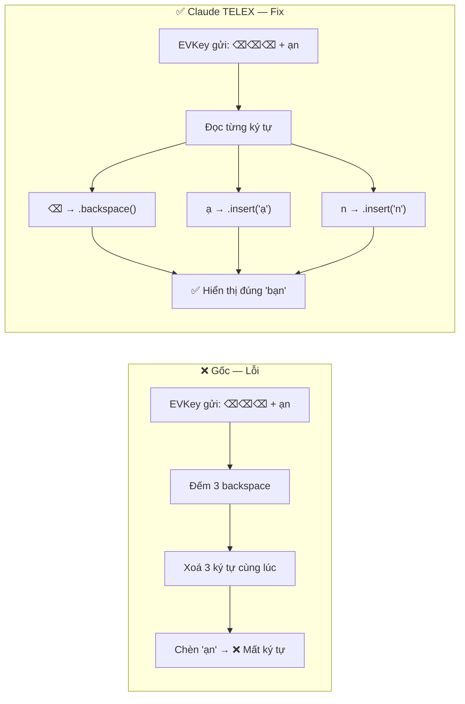
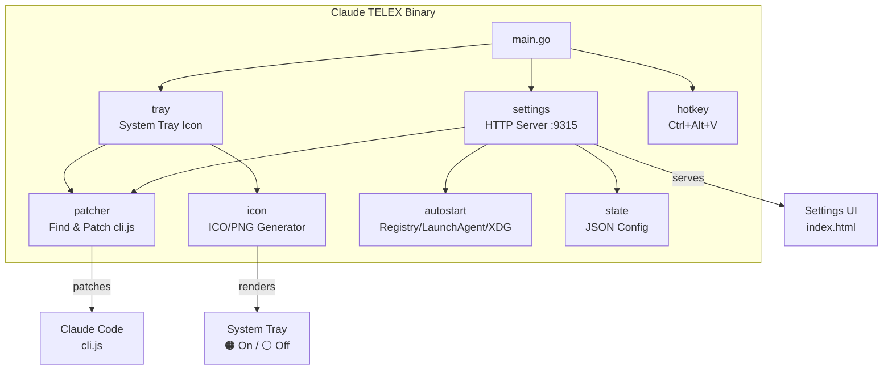
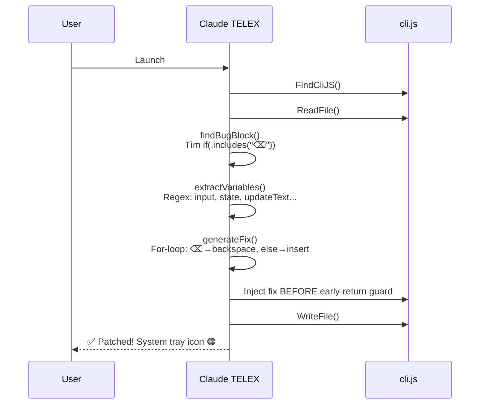

<p align="center">
  
  
  
</p>

<h1 align="center">Claude TELEX</h1>
<p align="center"><b>Vietnamese TELEX Input Fix for Claude Code CLI</b></p>
<p align="center">Sửa lỗi gõ tiếng Việt (TELEX) trong Claude Code CLI — hỗ trợ EVKey, UniKey, GoTiengViet</p>

---

## Vấn đề / The Problem

Khi gõ tiếng Việt bằng bộ gõ TELEX (EVKey, UniKey, GoTiengViet...) trong Claude Code CLI, ký tự bị **mất** hoặc **hiển thị sai** vì Claude Code xử lý ký tự xoá (backspace `\x7F`) theo nhóm thay vì từng ký tự.

> **Ví dụ:** Gõ `banj` mong đợi `bạn`, nhưng nhận được `bn` hoặc text bị lỗi.

## Giải pháp / The Solution

Claude TELEX **patch trực tiếp** vào file `cli.js` của Claude Code, thay thế logic xử lý nhóm backspace bằng vòng lặp xử lý **từng ký tự một**:



## Cài đặt / Installation

### Windows (PowerShell)

```powershell
irm https://raw.githubusercontent.com/nguyenhx2/claude-telex/main/install.ps1 | iex
```

### macOS / Linux

```bash
curl -fsSL https://raw.githubusercontent.com/nguyenhx2/claude-telex/main/install.sh | bash
```

### Từ Source

```bash
go install github.com/nguyenhx2/claude-telex/cmd/claude-telex@latest
```

## Sử dụng / Usage

Chạy `claude-telex` — app sẽ:

1. 🔍 Tự động tìm `cli.js` của Claude Code
2. 🩹 Patch logic xử lý backspace
3. 🖥️ Hiển thị icon ở system tray (cam = bật, xám = tắt)
4. ⚙️ Mở Settings UI tại `http://127.0.0.1:9315`

| Thao tác | Cách thực hiện |
|---|---|
| **Bật/Tắt fix** | Click tray icon → Settings, hoặc `Ctrl+Alt+V` |
| **Re-patch** | Settings UI → "Re-patch ngay" |
| **Khởi động cùng máy** | Settings UI → toggle "Khởi động cùng hệ thống" |
| **Thoát** | Right-click tray icon → Thoát |

## Kiến trúc / Architecture



### Package Overview

| Package | Chức năng |
|---|---|
| `cmd/claude-telex` | Entry point, single-instance lock, orchestration |
| `internal/patcher` | Tìm `cli.js`, trích xuất biến động bằng regex, inject fix |
| `internal/tray` | System tray (ICO trên Windows, PNG trên macOS/Linux) |
| `internal/settings` | HTTP server tại port 9315, JSON API |
| `internal/icon` | Vẽ icon programmatically (vòng tròn + chữ "VN") |
| `internal/hotkey` | Global hotkey `Ctrl+Alt+V` |
| `internal/autostart` | Tự khởi động: Windows Registry / macOS LaunchAgent / Linux XDG |
| `internal/state` | Lưu config JSON tại `~/.claude-telex/config.json` |
| `assets/ui` | Embedded HTML Settings UI (dark theme, Inter font) |

## Patching Flow



## Bộ gõ được hỗ trợ / Supported IME

| Bộ gõ | Trạng thái |
|---|---|
| **EVKey** | ✅ Hỗ trợ đầy đủ |
| **UniKey** | ✅ Hỗ trợ đầy đủ |
| **GoTiengViet** | ✅ Hỗ trợ đầy đủ |
|**ibus-bamboo** (Linux) | ✅ Hỗ trợ đầy đủ |
| Bộ gõ khác (gửi `\x7F`) | ✅ Hoạt động |

## Phát triển / Development

```bash
# Build
go build -ldflags="-s -w -H windowsgui" -o claude-telex.exe ./cmd/claude-telex

# Run (dev mode, with console)
go run ./cmd/claude-telex

# Test build for all platforms
goreleaser release --snapshot --clean
```

## Credits

- **Tác giả**: [@nguyenhx2](https://github.com/nguyenhx2)
- **Ngôn ngữ**: Go 1.22+
- **Thư viện**:
  - [`getlantern/systray`](https://github.com/getlantern/systray) — System tray
  - [`golang.design/x/hotkey`](https://pkg.go.dev/golang.design/x/hotkey) — Global hotkey
  - [`golang.org/x/image`](https://pkg.go.dev/golang.org/x/image) — Font rendering cho icon
- **Cảm hứng**: Vietnamese IME bug report từ cộng đồng Claude Code Việt Nam

## License

[MIT](LICENSE)
