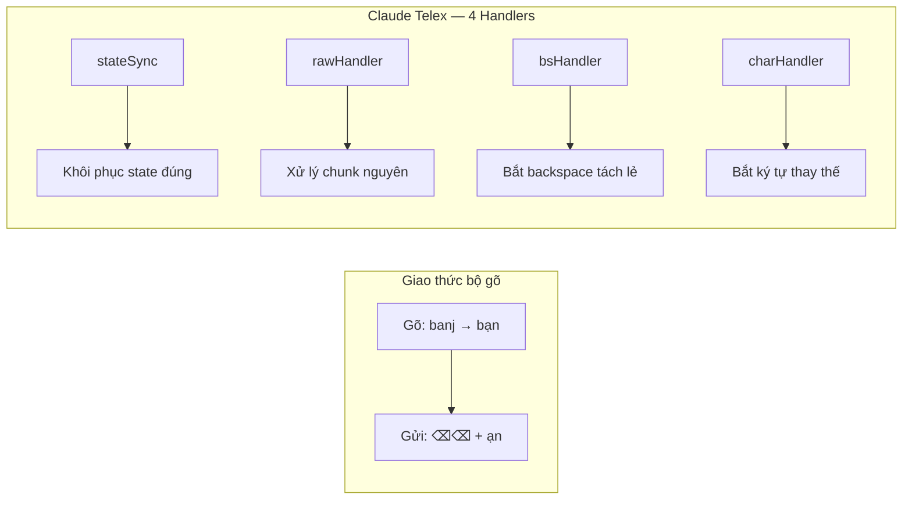
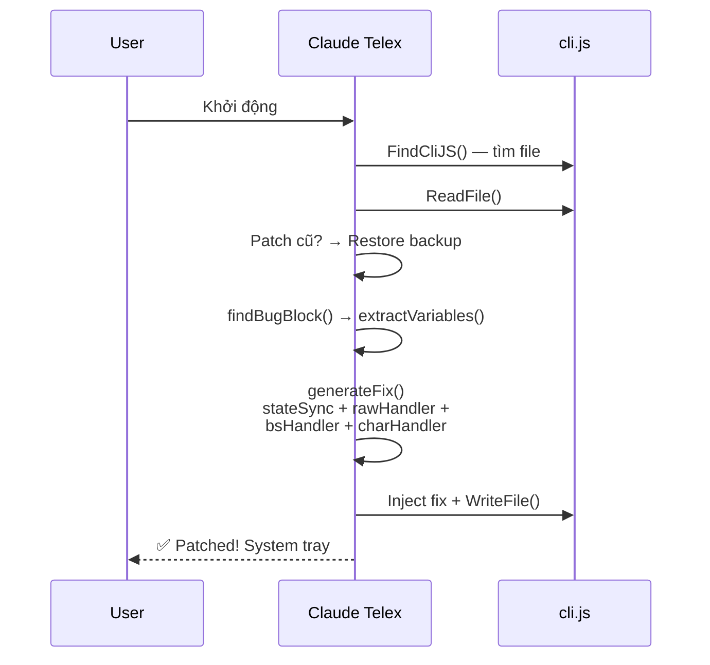
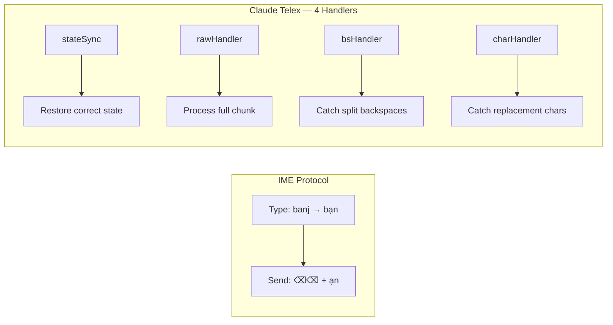
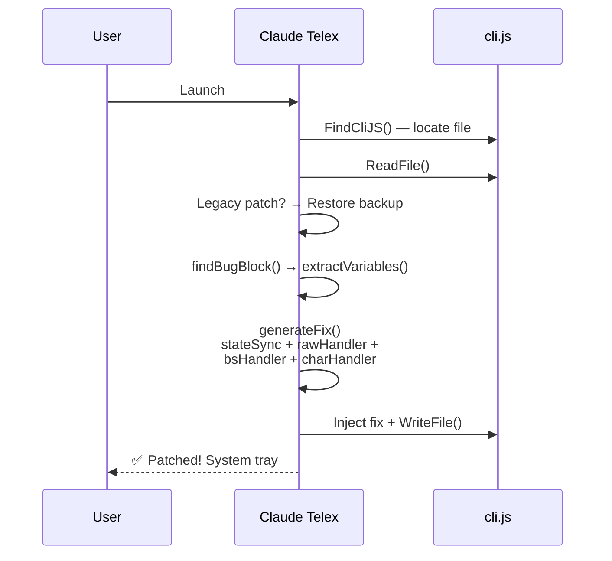

<p align="center">
  <a href="https://github.com/nguyenhx2/Claude-Telex"></a>
  
  
  
</p>

<h1 align="center">⌨️ Claude Telex</h1>

<p align="center">
  <a href="#vietnamese">🇻🇳 Tiếng Việt</a> ·
  <a href="#english">🇬🇧 English</a>
</p>

---

<a id="vietnamese"></a>

## 🇻🇳 Tiếng Việt

### Vấn đề

Khi gõ tiếng Việt bằng bộ gõ TELEX (EVKey, UniKey, GoTiengViet, [Gõ Nhanh](https://github.com/phucanh08/gonhanh)...) trong Claude Code CLI, ký tự bị **mất** hoặc **hiển thị sai**.

> **Ví dụ:** Gõ `banj` mong đợi `bạn`, nhưng nhận được `bn` hoặc text bị lỗi.

#### Tại sao lỗi xảy ra?

Bộ gõ tiếng Việt hoạt động bằng giao thức **xoá + thay thế**: gửi N ký tự xoá (`\x7F`) rồi gửi ký tự thay thế qua stdin. Claude Code (dựa trên React/Ink) gặp 3 vấn đề khi xử lý giao thức này:

| Vấn đề | Giải thích |
|---|---|
| **State cũ trong closure** | Hàm `onInput` đọc state từ React closure — state không cập nhật giữa các event trong cùng 1 burst |
| **Tách event** | Ink tách burst thành nhiều lần gọi riêng biệt — xoá và thay thế xảy ra ở các lần gọi khác nhau |
| **Hàm P6 dùng state lỗi** | Hàm xử lý ký tự `P6(J6)(t)` bắt state từ React render, không từ state đã được sửa |

### Giải pháp

Claude Telex **patch trực tiếp** vào `cli.js`, chèn 4 handler trước logic gốc để xử lý đúng giao thức IME:



| Handler | Chức năng |
|---|---|
| **stateSync** | Khôi phục state từ `__imeState` bridge, tự xoá khi React đã cập nhật hoặc khi nhấn phím điều khiển |
| **rawHandler** | Khi toàn bộ burst đến trong 1 chunk — xử lý nguyên khối |
| **bsHandler** | Khi Ink tách `\x7F` thành sự kiện backspace riêng — bridge state |
| **charHandler** | Khi ký tự thay thế đến sau backspace — dùng `insert()` trực tiếp, bỏ qua hàm P6 (state lỗi) |

### Cài đặt

#### Windows (PowerShell)

```powershell
irm https://raw.githubusercontent.com/nguyenhx2/Claude-Telex/main/install.ps1 | iex
```

#### macOS / Linux

```bash
curl -fsSL https://raw.githubusercontent.com/nguyenhx2/Claude-Telex/main/install.sh | bash
```

#### Từ Source

```bash
go install github.com/nguyenhx2/claude-telex/cmd/claude-telex@latest
```

### Sử dụng

Chạy `claude-telex` - app sẽ:

1. 🔍 Tự động tìm `cli.js` của Claude Code
2. 🩹 Patch logic xử lý IME
3. 🖥️ Hiển thị icon ở system tray (cam = bật, xám = tắt)
4. ⚙️ Mở Settings UI tại `http://127.0.0.1:9315`

| Thao tác | Cách thực hiện |
|---|---|
| **Bật/Tắt fix** | Click tray icon → Settings, hoặc `Ctrl+Alt+V` |
| **Re-patch** | Settings UI → "Re-patch ngay" |
| **Khởi động cùng máy** | Settings UI → toggle "Khởi động cùng hệ thống" |
| **Thoát** | Right-click tray icon → Thoát |

### ⌨️ Bộ gõ được hỗ trợ

| Bộ gõ | Hệ điều hành | Trạng thái |
|---|---|---|
| **EVKey** | Windows | ✅ Hỗ trợ đầy đủ |
| **UniKey** | Windows | ✅ Hỗ trợ đầy đủ |
| **GoTiengViet** | Windows / macOS | ✅ Hỗ trợ đầy đủ |
| **[Gõ Nhanh](https://github.com/phucanh08/gonhanh)** | macOS | ✅ Hỗ trợ đầy đủ |
| **ibus-bamboo** | Linux | ✅ Hỗ trợ đầy đủ |
| Bộ gõ khác (gửi `\x7F`) | Tất cả | ✅ Hoạt động |

### Tương thích

| Thành phần | Phiên bản | Trạng thái |
|---|---|---|
| **Claude Code** | Mọi phiên bản (npm `@anthropic-ai/claude-code`) | ✅ Hỗ trợ |
| **Windows** | 10 / 11 (amd64, arm64) | ✅ Hỗ trợ |
| **macOS** | 12 Monterey+ (Intel & Apple Silicon) | ✅ Hỗ trợ |
| **Linux** | Ubuntu 20.04+, Fedora 36+, Arch (amd64, arm64) | ✅ Hỗ trợ |

### Quy trình Patching



### Build & Chạy

#### Yêu cầu

- **Go** 1.22+ ([tải tại đây](https://go.dev/dl/))
- **Git** ([tải tại đây](https://git-scm.com/))
- **Linux**: cần thêm `gcc`, `libgtk-3-dev`, `libappindicator3-dev`

#### Build

```bash
# Clone repo
git clone https://github.com/nguyenhx2/Claude-Telex.git
cd Claude-Telex

# Build binary
go build -ldflags="-s -w -H windowsgui" -o claude-telex.exe ./cmd/claude-telex   # Windows
go build -ldflags="-s -w" -o claude-telex ./cmd/claude-telex                      # macOS / Linux
```

#### Chạy (Development)

```bash
go run ./cmd/claude-telex
```

---

<a id="english"></a>

## 🇬🇧 English

### The Problem

When typing Vietnamese using TELEX IME (EVKey, UniKey, GoTiengViet, [Gõ Nhanh](https://github.com/phucanh08/gonhanh)...) in Claude Code CLI, characters are **lost** or **displayed incorrectly**.

> **Example:** Typing `banj` expecting `bạn`, but getting `bn` or garbled text.

#### Why does this happen?

Vietnamese IMEs use a **delete + replace** protocol: send N delete characters (`\x7F`) then replacement chars via stdin. Claude Code (built on React/Ink) has 3 issues processing this protocol:

| Issue | Explanation |
|---|---|
| **Stale closure state** | `onInput` reads state from a React closure — this state doesn't update between events in a burst |
| **Split events** | Ink splits the burst into separate calls — deletes and replacements arrive in different calls |
| **P6 uses stale state** | The text processor `P6(J6)(t)` captures state from React render, not from the bridged state |

### The Solution

Claude Telex **directly patches** `cli.js`, injecting 4 handlers before the original logic to correctly process the IME protocol:



| Handler | Purpose |
|---|---|
| **stateSync** | Restores state from `__imeState` bridge, auto-clears when React catches up or on control keys |
| **rawHandler** | When the entire burst arrives in 1 chunk — processes atomically |
| **bsHandler** | When Ink splits `\x7F` into separate backspace events — bridges state |
| **charHandler** | When replacement chars arrive after backspaces — uses `insert()` directly, bypassing P6 (stale state) |

### Installation

#### Windows (PowerShell)

```powershell
irm https://raw.githubusercontent.com/nguyenhx2/Claude-Telex/main/install.ps1 | iex
```

#### macOS / Linux

```bash
curl -fsSL https://raw.githubusercontent.com/nguyenhx2/Claude-Telex/main/install.sh | bash
```

#### From Source

```bash
go install github.com/nguyenhx2/claude-telex/cmd/claude-telex@latest
```

### Usage

Run `claude-telex` - the app will:

1. 🔍 Auto-detect Claude Code's `cli.js`
2. 🩹 Patch IME handling logic
3. 🖥️ Show a system tray icon (orange = on, grey = off)
4. ⚙️ Open Settings UI at `http://127.0.0.1:9315`

| Action | How |
|---|---|
| **Toggle fix** | Click tray icon → Settings, or `Ctrl+Alt+V` |
| **Re-patch** | Settings UI → "Re-patch now" |
| **Start with OS** | Settings UI → toggle "Start with system" |
| **Exit** | Right-click tray icon → Exit |

### ⌨️ Supported IME

| IME | OS | Status |
|---|---|---|
| **EVKey** | Windows | ✅ Fully supported |
| **UniKey** | Windows | ✅ Fully supported |
| **GoTiengViet** | Windows / macOS | ✅ Fully supported |
| **[Gõ Nhanh](https://github.com/phucanh08/gonhanh)** | macOS | ✅ Fully supported |
| **ibus-bamboo** | Linux | ✅ Fully supported |
| Other IMEs (sending `\x7F`) | All | ✅ Works |

### Compatibility

| Component | Version | Status |
|---|---|---|
| **Claude Code** | All versions (npm `@anthropic-ai/claude-code`) | ✅ Supported |
| **Windows** | 10 / 11 (amd64, arm64) | ✅ Supported |
| **macOS** | 12 Monterey+ (Intel & Apple Silicon) | ✅ Supported |
| **Linux** | Ubuntu 20.04+, Fedora 36+, Arch (amd64, arm64) | ✅ Supported |

### Patching Flow



### Build & Run

#### Prerequisites

- **Go** 1.22+ ([download](https://go.dev/dl/))
- **Git** ([download](https://git-scm.com/))
- **Linux**: also needs `gcc`, `libgtk-3-dev`, `libappindicator3-dev`

#### Build

```bash
# Clone the repo
git clone https://github.com/nguyenhx2/Claude-Telex.git
cd Claude-Telex

# Build binary
go build -ldflags="-s -w -H windowsgui" -o claude-telex.exe ./cmd/claude-telex   # Windows
go build -ldflags="-s -w" -o claude-telex ./cmd/claude-telex                      # macOS / Linux
```

#### Run (Development)

```bash
go run ./cmd/claude-telex
```

---

<p align="center">

**⌨️ Claude Telex** - Vietnamese TELEX Support for Claude Code CLI

</p>

<p align="center">
  <a href="https://github.com/nguyenhx2">@nguyenhx2</a> ·
  Go 1.22+ ·
  <a href="https://github.com/nguyenhx2/Claude-Telex">GitHub</a> ·
  <a href="LICENSE">MIT License</a>
</p>

<p align="center">
  <b>Thư viện / Libraries:</b>
  <a href="https://github.com/getlantern/systray">getlantern/systray</a> -
  <a href="https://pkg.go.dev/golang.design/x/hotkey">golang.design/x/hotkey</a> -
  <a href="https://pkg.go.dev/golang.org/x/image">golang.org/x/image</a>
</p>

<p align="center">
  <b>Tài liệu kĩ thuật / Technical Docs:</b>
  Thuật toán patch được thiết kế dựa trên <a href="docs/core-engine-algorithm.md">tài liệu kiến trúc engine</a> và <a href="docs/validation-algorithm.md">thuật toán validation</a> của <a href="https://github.com/phucanh08/gonhanh">Gõ Nhanh</a>
</p>

<p align="center">
  <i>Cảm hứng / Inspired by: Vietnamese IME bug reports from the Claude Code Vietnam community</i>
</p>
